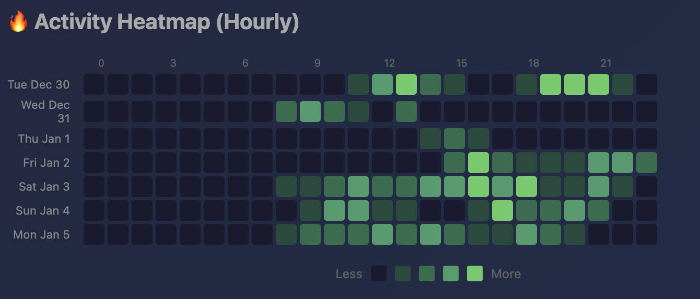

# Charts


`typtel` ships a rich statistics **dashboard**: a single self-contained HTML
page driven by [Chart.js](https://www.chartjs.org/) that visualises your
keystroke, word, mouse, and activity history. It is generated locally from your
SQLite database and written to:

```
~/.local/share/typtel/logs/charts.html
```

The page is then opened in your default browser. **Nothing leaves the
machine** — the only network request is the Chart.js `<script>` tag pulled from
a CDN to render the canvases; all of your data is inlined into the HTML.

One generator (`internal/charts`) backs every front-end — the macOS menu bar,
the Linux tray, and the CLI all call `charts.Generate` and render the identical
dashboard. The only platform-specific input is the pixels→feet conversion used
for mouse distance: the macOS menu bar injects a display-aware version, while
the CLI and Linux tray fall back to a fixed 100-PPI approximation.

## Opening the dashboard

=== "CLI (any platform)"

    ```sh
    typtel v
    ```

    `v` has the aliases `view` and `charts`, so `typtel view` and
    `typtel charts` are equivalent. The generated `charts.html` is opened with
    the OS default browser — `open` on macOS, `xdg-open` on Linux.

=== "macOS"

    Open the [menu bar](macos.md) and choose **View Charts**.

=== "Linux"

    Open the [tray](linux.md) and choose **View Charts**.

The CLI's Bubble Tea TUI can also jump straight here — selecting the charts
action in the TUI exits and runs the same `viewCharts()` path.

## Time periods

A **Time Period** selector at the top of the page switches every chart and stat
between three windows:

- **Weekly** — last 7 days
- **Monthly** — last 30 days
- **Yearly** — last 365 days

All three datasets are generated up front and embedded in the page, so
switching periods is instant and works offline. Each window is a contiguous run
of calendar days ending today (`GetHistoricalStats` walks back day-by-day from
the current date, so missing days appear as zero rather than being skipped).

A fourth selection, **Odometer**, swaps the charts/heatmap view for the session
panel described [below](#odometer-session-and-history).

## Charts

### Keystrokes per day

A **bar chart** of total keystrokes for each day in the selected period
(`DailyStats.Keystrokes`). X-axis labels are short dates (`Jan 2`).

### Words per day

A **line chart** (filled, smoothed) of words committed each day
(`DailyStats.Words`). Words are counted by the word-boundary detector in
`internal/wordcounter`, not by character count.

### Mouse distance per day

A **bar chart** of pointer travel per day, with a **Distance Unit** selector
that re-expresses the values as **feet**, **car lengths (~15 ft)**, or
**frisbee fields (~330 ft)**. The chart title updates to reflect the unit.

Mouse distance only exists on macOS, where the menu-bar daemon tracks pointer
movement. On the **Linux tray there is no mouse data**, so the series — and the
Mouse Distance / Mouse Clicks summary stats — read **zero**.

### Key-Type Breakdown per day

A **stacked bar chart** splitting each day's keystrokes into three classes —
**Letters** (A–Z), **Modifiers** (Shift, Control, Option/Alt, Command, Fn, Caps
Lock), and **Special** keys (numbers, punctuation, function keys, arrows, Tab,
Return, Space, Backspace, Delete, Escape, …). The classification comes from
`storage.ClassifyKeycode`.

This chart, and its companion summary stats (Letters / Modifiers / Special), are
**hidden unless the "Show Key Types" toggle is enabled** — see
[Show Key Types](#show-key-types) below.

### Activity heatmap (hourly)



A GitHub-style **heatmap**: one row per day, 24 cells per row (one per hour),
shaded from dark to green by that hour's keystroke count relative to the busiest
hour in the window. Built from `GetAllHourlyStatsForDays`, which collects hourly
buckets for every day in the period. Hovering a cell shows the exact date, hour,
and keystroke count.

## Summary stats

Above the charts, two rows of headline numbers update with the selected period.

**Primary row:**

| Stat | Meaning |
| --- | --- |
| Total Keystrokes | Sum of keystrokes over the window |
| Words | Sum of committed words |
| Avg Keystrokes/Day | Total keystrokes ÷ number of days in the window |
| Avg Words / Active Day | Mean words across days with at least one keystroke (idle days excluded) — `stats.CalculateAverageWordsActive` |
| Mouse Distance | Total pointer travel (macOS only; zero on Linux) |
| Mouse Clicks | Total clicks (macOS only; zero on Linux) |

**Secondary row** (derived from `pkg/stats`):

| Stat | Meaning |
| --- | --- |
| Peak Day | Highest single-day keystroke count, with its date — `stats.FindPeakDay` (earliest day wins ties) |
| Peak Words Day | Highest single-day word count, with its date |
| Most Active Hour | Hour-of-day with the most keystrokes across the window, as a 12-hour label — `stats.FindPeakHour` + `stats.FormatHour` |
| Current Streak | Consecutive active days ending today — `stats.CurrentStreak` |
| Longest Streak | Longest run of consecutive active days in the window — `stats.LongestStreak` |
| Active Days | Days with at least one keystroke, shown as `n / days` — `stats.CountActiveDays` |

An "active day" is any day with at least one keystroke; this is what streaks and
the active-day average are measured against.

## Odometer session and history

Selecting **Odometer** in the period selector hides the charts and shows the
trip-meter panel:

- **Current Session** — an Active/Inactive status plus the running totals since
  the session started (start time, keystrokes, words, mouse clicks, mouse
  distance, and elapsed duration). Values are the deltas between the session's
  current and start counters (`GetOdometerSession`).
- **Session History** — a table of completed sessions with start/end times,
  duration, and per-session keystroke, word, click, and distance totals
  (`GetOdometerHistory`). Empty until you finish a session.

The Distance Unit selector also applies to the odometer's distance figures.

## Show Key Types

The **Key-Type Breakdown** chart and the Letters/Modifiers/Special summary stats
are gated behind a **"Show Key Types"** setting (`IsShowKeyTypesEnabled`).
When disabled (the default), the generator emits those sections with
`display: none` and the dashboard shows only the keystroke, word, mouse, and
heatmap views. When enabled, the breakdown becomes visible across all periods.

Toggle it from:

- **macOS** — the menu-bar **Settings**.
- **Linux** — the **tray** menu.

See the [settings reference](reference/settings.md) for the full list of display
and capture toggles.
