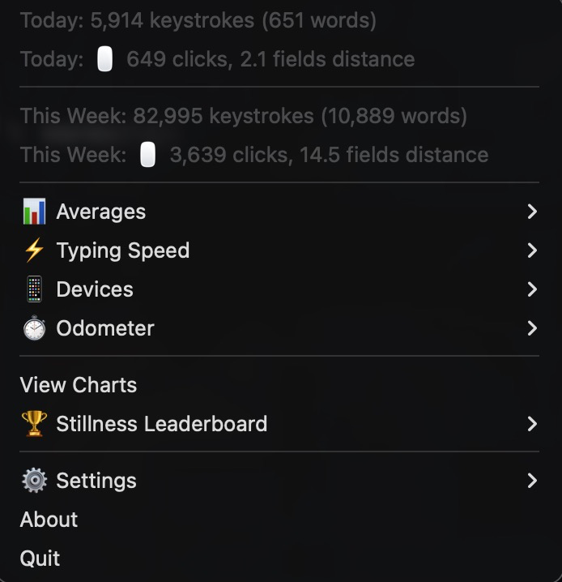

# macOS (menu bar)

{ .off-glb }

`typtel` ships on macOS as **Typtel.app** — a menu-bar daemon that captures
keystrokes and (optionally) mouse activity into a local SQLite database at
`~/.local/share/typtel/typtel.db`. Nothing leaves the machine. Install it with
the Homebrew cask:

```sh
brew tap abaj8494/typing-telemetry
brew install --cask typtel
```

The app enforces a single running instance (a file lock in the data dir), so a
LaunchAgent daemon plus a manual launch won't produce two icons.

!!! warning "Accessibility permission is required"
    The keystroke tap can't start without it — see
    [Accessibility permission](#accessibility-permission) below. If the grant
    is missing the app shows a permission notice and exits before capturing
    anything.

## The menu-bar title

The status-item title is built from your enabled display toggles (see
[Settings](#settings)). With the defaults it shows today's keystrokes and
words, e.g. `⌨️12,345 | 678w`. Mouse clicks (`🖱️`) and distance are appended
only when their toggles are on and there is data to show. Counts are formatted
with thousands separators.

**Clicking the icon turns the title orange** and, while the menu is open,
replaces the keystroke/word figures with the **sum across this Mac plus every
connected [device](multi-device.md)**'s today totals. The highlight and the
summed total revert to Mac-only as soon as the menu closes. Clicks and distance
stay Mac-only in both states — devices report neither.

## Menu sections

{ width="380" }

Opening the menu (left-click) reveals, top to bottom:

| Item | Shows |
|------|-------|
| **Today** | Keystrokes (and words); a second row for `🖱️` clicks and distance |
| **This Week** | Trailing-7-day keystrokes/words, plus clicks and distance |
| **📊 Averages** | Per-hour averages for today and this week, plus per-day averages over the week (keystrokes / words / clicks / distance) |
| **⚡ Typing Speed** | Average WPM over rolling windows (Today / This Week / This Month / This Year / All-Time) and all-time fastest pace: 10-word burst, 60-second window, best clock-minute |
| **📱 Devices** | Per-device *today* stats (keystrokes, words, letter/modifier/special breakdown, active time, last seen). **Hidden until an external device registers** — see [multi-device feed](multi-device.md) |
| **View Charts** | Generates and opens the HTML dashboard in your browser — see [charts](charts.md) |
| **🏆 Stillness Leaderboard** | Days with the least mouse movement; opens a full ranked HTML page |
| **⏱️ Odometer** | A session tracker: Start/Stop (with a configurable hotkey), Reset, Clear History. Captures keystroke/word/click/distance deltas between start and stop |
| **⚙️ Settings** | Display, tracking, charts, word-counting, and inertia controls — see below |
| **About** | App version, the running PID, and a button to open the GitHub repo |
| **Quit** | Confirms, then stops capture and exits |

!!! note "Averages and active time"
    "Active hours" are the hours of the day that had at least one keystroke, so
    averages aren't diluted by hours you were away. Average WPM is measured
    against *active* typing time (idle gaps are excluded), not wall-clock time.

### Odometer

The odometer records a session: pick **Start Odometer**, work, then **Stop** to
file the keystroke/word/click/distance totals for that interval into history. A
session can also be toggled by a global hotkey, chosen under **Configure
Hotkey**: `Cmd+Ctrl+O` (default), `Cmd+Shift+O`, `Cmd+Opt+O`, or `Ctrl+Shift+O`.

## Settings

The **⚙️ Settings** submenu. Each control persists immediately to the settings
table; see the [Settings reference](reference/settings.md) for the full key
list.

### Menu Bar Display

| Control | Effect | Default |
|---------|--------|---------|
| **Show Keystrokes** | Include `⌨️<count>` in the title | On |
| **Show Words** | Include `<count>w` in the title | On |
| **Show Mouse Clicks** | Include `🖱️<count>` in the title | Off |
| **Show Mouse Distance** | Include traveled distance in the title | Off |
| **Distance Unit** | How distance renders everywhere: **Feet / Miles**, **Cars (15 ft each)**, or **Frisbee Fields (330 ft)** | Feet / Miles |

### Tracking

- **Enable Mouse Distance** — turns the mouse position/click tracker on or off.

!!! info "Requires a restart"
    Toggling **Enable Mouse Distance** shows a dialog telling you to restart the
    app; the tracker is only started/stopped at launch.

### Charts

- **Show Key Types (Letters/Modifiers/Special)** — adds a key-type breakdown to
  the generated [charts](charts.md). Keystrokes are always classified into
  letter / modifier / special at capture time; this toggle only controls whether
  the breakdown is rendered.

### Word Counting

- **Strict Mode (filter by app)** — when on, only keystrokes from apps on the
  allowlist are counted; keystrokes from other apps are dropped entirely. Off by
  default. (The word-boundary heuristics in the counter always apply regardless
  of this setting.)
- **Allowed Apps** — a checkbox per app bundle ID the daemon has observed.
  Until you've typed in a few apps it shows a "no apps observed yet" hint. Edits
  take effect live, without a restart.

### Inertia (key acceleration)

The submenu exposes **Enable Inertia**, **Max Speed**, **Threshold (ms)**, and
**Acceleration Rate**. Changes to speed/threshold/rate apply live to the running
inertia engine. For what inertia does and how to tune each control, see
[inertia](inertia.md).

## Accessibility permission

Typtel uses a CGEventTap to read keystrokes, which macOS gates behind the
Accessibility permission:

1. **System Settings → Privacy & Security → Accessibility**
2. Add `/Applications/Typtel.app` (the **+** button) and enable its checkbox.
3. Relaunch from the menu bar or with `open /Applications/Typtel.app`.

!!! danger "Re-grant after every `brew upgrade`"
    `brew upgrade --cask typtel` replaces the app binary, which changes its
    cdhash. macOS treats the new binary as a different app and **silently drops
    the existing Accessibility grant**. The daemon checks the permission at
    startup and **exits before capture begins** if it's missing — so after an
    upgrade you may see no menu-bar icon at all. Fix it by **removing** Typtel
    from the Accessibility list and **re-adding** it, then relaunching.

!!! note "Uninstalling doesn't clean the list"
    Deleting the app may leave a stale Typtel entry in the Accessibility list.
    Remove it manually if you want a clean slate.

## Updating and uninstalling

```sh
brew update
brew upgrade --cask typtel          # then re-grant Accessibility (see above)

brew uninstall --cask typtel
rm -rf ~/.local/share/typtel        # optional: also delete the local data
```

!!! tip "SHA-256 mismatch right after a release"
    Releases are built by CI and the cask's checksum is pinned by a follow-up
    commit moments later. If an upgrade immediately after a new version reports a
    SHA-256 mismatch, wait a minute for that commit to land, then `brew update`
    and retry.
